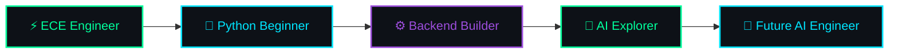

<div align="center">


<br>


</div>

<br>

```
> Initializing Developer.exe...

  Loading Python skills      ███████░░░  70%
  Backend powers             █████░░░░░  50%
  AI Engineering             ████░░░░░░  40%
  Coffee reserves            ██████████ 100%
  Sleep Mode                 ❌ Disabled

> Boot sequence complete. Ready to break (and fix) things.
```

<br>

## 👋 Hi, I'm Aboobaker

An Electronics & Communication Engineer who took one look at circuits and said *"what if I made this harder for myself"* — and switched to software.

```
$ whoami
> aspiring AI application developer, professionally confused, permanently curious

$ status
> "My code works. I don't know why."
> "Debugging since birth."
> "Currently teaching Python not to crash."
```

I take coding seriously. I do not take myself seriously. There's a difference, and my commit history proves it.

<br>

---

<br>

## 🧠 About Me

```python
class Developer:
    def __init__(self):
        self.name = "Aboobaker Siddique"
        self.background = "Electronics & Communication Engineering"
        self.current_role = "AI Application Developer (in training)"
        self.currently_learning = [
            "FastAPI", "RAG pipelines", "AI Agents", "Vector DBs"
        ]
        self.philosophy = "Ship it, break it, understand it, ship it better."

    def coffee_to_code(self, coffee: int) -> str:
        return "production-ready feature" if coffee > 2 else "syntax error"


me = Developer()
```

- 🎓 ECE graduate who found more excitement in `print()` than in Ohm's Law
- 🔁 Currently rebuilding myself, one framework at a time
- 🤖 Long-term goal: build AI systems that solve problems people actually have
- 🧩 Coding philosophy: understand the bug before you fix it, understand the fix before you ship it
- ☕ Fueled by curiosity, caffeine, and an unreasonable number of open tabs

<br>

---

<br>

## 🧬 My Developer Evolution



**The roadmap:**

```mermaid
graph LR
    P["Python"] --> B["Backend Dev"] --> F["FastAPI"] --> A["APIs"] --> L["LLM Apps"] --> R["RAG"] --> AG["AI Agents"] --> PR["Production AI 🚀"]

    style P fill:#0D1117,stroke:#00FF9C,color:#00FF9C
    style B fill:#0D1117,stroke:#00FF9C,color:#00FF9C
    style F fill:#0D1117,stroke:#00E5FF,color:#00E5FF
    style A fill:#0D1117,stroke:#00E5FF,color:#00E5FF
    style L fill:#0D1117,stroke:#9D4EDD,color:#9D4EDD
    style R fill:#0D1117,stroke:#9D4EDD,color:#9D4EDD
    style AG fill:#0D1117,stroke:#00FF9C,color:#00FF9C
    style PR fill:#0D1117,stroke:#00E5FF,color:#00E5FF
```



<br>

---

<br>

## 🛠️ Tech Stack

**Languages**


**Backend**

   

`🔜 Learning next:`    

**AI Engineering**

     

`🔜 Learning next:`      

**Tools**


`🔜 Learning next:`   

<br>

---

<br>

## 🚀 Projects

### ✅ Completed

| Project | What it does |
|---|---|
| **Calculator** | The classic first boss fight. Defeated. |
| **Password Generator** | Generates passwords stronger than my sleep schedule. |
| **Expense Tracker** | Tracks where my money goes so I don't have to feel bad about not knowing. |
| **File Organizer** | Because my Downloads folder was a certified crime scene. |

### 🔨 Building Now

**💰 Personal Finance Manager**
A Python app for tracking expenses, categorizing spending, and generating reports — built to answer the question "where did it all go?"

```
Backend    █████░░░░░ 50%
Features   ████░░░░░░ 40%
Bugs       ██████████ 100% (a feature, not a bug)
```

### 🤖 AI Projects — In the Lab

| Project | The Pitch |
|---|---|
| **AI Fitness Coach** | An LLM-powered assistant that gives evidence-based fitness answers instead of "bro science." |
| **PDF Chatbot** | Talk to your PDFs. They finally talk back. |
| **Resume Analyzer** | An AI that roasts your resume before the recruiter does. |
| **AI Research Assistant** | A RAG-powered agent that reads papers faster than I ever will. |
| **Company Knowledge Assistant** | An internal AI agent that turns scattered docs into actual answers. |

<br>

---

<br>

## ⚙️ Previous Engineering Projects

**🔥 Fire Fighting Robot**
Arduino UNO · Sensors · Motors — an autonomous bot built to detect and respond to fire before things got real.

**🫁 Breath Monitoring System**
ESP32 · MQ Sensors · OLED Display · IoT — a real-time respiratory monitoring system built during my ECE days.

<br>

---

<br>

## 🐛 Bugs I Fight Daily

```
Bug:      "It worked yesterday."
Me:       "What changed?"
Computer: "Everything."

Bug:      "Undefined is not a function."
Me:       "Neither am I, at this hour."

Bug:      "Works on my machine."
Production: "Not on mine."
```

<br>

---

<br>

## 📊 GitHub Stats

<div align="center">


<br><br>


<br><br>


</div>

<br>

---

<br>

## 🐍 Contribution Snake

<div align="center">


</div>

<details>
<summary><b>⚙️ Setup instructions (one-time, if the snake isn't showing yet)</b></summary>

<br>

1. Create a file at `.github/workflows/snake.yml` in your profile repo (`AboobakerSiddique/AboobakerSiddique`) with:

```yaml
name: Generate Snake

on:
  schedule:
    - cron: "0 */6 * * *"
  workflow_dispatch:
  push:
    branches:
      - main

jobs:
  generate:
    runs-on: ubuntu-latest
    steps:
      - uses: Platane/snk@v3
        id: snake-gif
        with:
          github_user_name: ${{ github.repository_owner }}
          outputs: |
            dist/github-contribution-grid-snake.svg
            dist/github-contribution-grid-snake-dark.svg?palette=github-dark

      - uses: crazy-max/ghaction-github-pages@v4
        with:
          target_branch: output
          build_dir: dist
        env:
          GITHUB_TOKEN: ${{ secrets.GITHUB_TOKEN }}
```

2. Push it, let the Action run once, and the `output` branch will appear with the generated SVG.
3. The image link above will then render automatically.

</details>

<br>

---

<br>

## 🎯 2026 Mission

- [ ] Master Python at a production level
- [ ] Get fluent in FastAPI
- [ ] Build and ship real RAG systems
- [ ] Build multi-step AI Agents
- [ ] Ship a production-grade AI application
- [ ] Contribute to open source
- [ ] Land my first AI Developer role

<br>

---

<br>

<div align="center">

### 🧠 Human Status

```
☕ Coffee              100%
🐛 Bugs Fixed          999+
🤖 AI Knowledge        Loading...
💾 Sleep.exe           Not Responding

SYSTEM MESSAGE: Never stop building.
```


</div>
