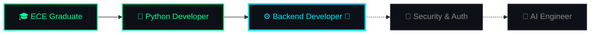

<div align="center">


<br>


</div>

<br>

```
> Initializing Developer.exe...

  Python fundamentals        ████████░░  75%
  Backend (FastAPI)          ██████░░░░  55%
  Authentication & Security  ████░░░░░░  35%
  AI Engineering             █░░░░░░░░░  10%
  Sleep Mode                 ❌ Disabled

> Boot sequence complete. Currently in progress, not perfection.
```

<br>

## 👋 Hi, I'm Aboobaker

An Electronics & Communication Engineering graduate now building backend systems in Python — currently deep in FastAPI, databases, and authentication, with AI Engineering as the long-term destination.

```
$ whoami
> backend developer in training, documenting the journey in public

$ status
> "My code works. I don't always know why on the first try."
> "Debugging is just part of the process now."
```

I take the work seriously. I keep the tone light. Both things can be true.

<br>

---

<br>

## 🧠 About Me

```python
class Developer:
    def __init__(self):
        self.name = "Aboobaker Siddique"
        self.background = "Electronics & Communication Engineering"
        self.current_role = "Backend Developer (transitioning into AI Engineering)"
        self.currently_learning = [
            "JWT", "Dependency Injection", "Security",
            "Backend Architecture", "Advanced FastAPI"
        ]
        self.philosophy = "Build it properly, understand it fully, then move on."

    def next_step(self) -> str:
        return "Ship the current API, then start on JWT auth."


me = Developer()
```

- 🎓 ECE graduate, now building software instead of circuits
- 🐍 Focused on Python backend development — FastAPI, SQLAlchemy, REST APIs
- 🔐 Currently learning authentication, security, and backend architecture
- 📖 Publicly documenting every stage of the transition into AI Engineering
- 🎯 Approach: only claim skills I've actually built something with

<br>

---

<br>

## 🧬 Developer Evolution


```mermaid
graph LR
    A["🎓 ECE Graduate"] --> B["🐍 Python Developer"]
    B --> C["⚙️ Backend Developer 📍"]
    C -.-> D["🔐 Security & Auth"]
    D -.-> E["🤖 AI Engineer"]

    style A fill:#0D1117,stroke:#00FF9C,stroke-width:2px,color:#00FF9C
    style B fill:#0D1117,stroke:#00FF9C,stroke-width:2px,color:#00FF9C
    style C fill:#0D1117,stroke:#00E5FF,stroke-width:3px,color:#00E5FF
    style D fill:#0D1117,stroke:#666666,stroke-width:1px,color:#888888
    style E fill:#0D1117,stroke:#666666,stroke-width:1px,color:#888888
```

📍 = current stage · dashed = not there yet

<br>

---

<br>

## 🛠️ Tech Stack

*Only technologies I've actually used and built projects with.*

**Languages**

  

**Backend & APIs**

     

**Authentication & Security**

   

**GUI**


**Embedded / IoT**

 

**Tools**

 

<br>

---

<br>

## 🚀 Future Learning Roadmap

| Skill | Status |
|---|:---:|
| Python | ✅ |
| FastAPI | ✅ |
| Authentication | 🔄 |
| JWT | 🔄 |
| Docker | ⏳ |
| Redis | ⏳ |
| AI APIs | ⏳ |
| LLMs | ⏳ |
| LangChain | ⏳ |
| RAG | ⏳ |
| AI Agents | ⏳ |
| Production AI Systems | ⏳ |

✅ Done &nbsp;·&nbsp; 🔄 In progress &nbsp;·&nbsp; ⏳ Not started yet

<br>

---

<br>

## 📈 Weekly Learning Progress

| Week | Status | Focus |
|---|:---:|---|
| Week 1 | ✅ | Python |
| Week 2 | ✅ | Intermediate Python |
| Week 3 | ✅ | FastAPI + SQLAlchemy |
| Week 4 | 🔄 | Authentication |
| Week 5 | ⏳ | JWT |
| Week 6 | ⏳ | AI APIs |

<br>

---

<br>

## 🏗 Current Focus

- Building secure backend applications
- Learning authentication and security fundamentals
- Creating portfolio-quality REST APIs
- Documenting the learning process publicly, week by week

<br>

---

<br>

## 📚 Recent Achievements

- ✅ Built Student Management API
- ✅ Built Task Manager API
- ✅ Learned SQLAlchemy
- ✅ Learned Authentication Fundamentals

<br>

---

<br>

## 🎯 Next Milestone

- JWT Authentication
- Docker
- OpenAI API
- First AI Assistant

<br>

---

<br>

## 💼 Projects

| Project | Description |
|---|---|
| **Student Management API** | REST API for managing student records — CRUD operations, SQLAlchemy models, Pydantic validation. |
| **Student Management GUI** | Desktop interface for the Student Management system, built with Tkinter. |
| **Task Manager API** | A FastAPI backend for creating, updating, and tracking tasks with a SQLite database. |
| **Library Management API** | API for managing books, members, and borrowing records — REST endpoints with Swagger docs. |
| **Authentication API** | A FastAPI service implementing password hashing with bcrypt/Passlib and core auth fundamentals. |
| **Python Mini Projects** | A collection of smaller Python exercises and utilities, built while strengthening the fundamentals. |
| **AI Developer Roadmap** | A public repo tracking my week-by-week transition from backend developer to AI engineer. |

<br>

---

<br>

## ⚙️ Previous Engineering Projects

**🔥 Fire Fighting Robot** — Arduino UNO, sensors, motors — an autonomous bot built to detect and respond to fire.

**🫁 Breath Monitoring System** — ESP32, MQ sensors, OLED display — a real-time respiratory monitoring system built during my ECE coursework.

<br>

---

<br>

## 📊 GitHub Stats

<div align="center">


<br><br>


<br><br>


</div>

<br>

---

<br>

## 🐍 Contribution Snake

<div align="center">


</div>


<br>

---

<br>

## 🎯 2026 Mission

- [ ] Master Python at a production level
- [ ] Get fluent in FastAPI and backend architecture
- [ ] Complete JWT authentication and security fundamentals
- [ ] Learn Docker and containerize a project
- [ ] Build my first AI-powered application
- [ ] Contribute to open source
- [ ] Land my first AI Developer / Backend role

<br>

---

<br>

<div align="center">

### 🧠 Human Status

```
☕ Coffee              100%
🐛 Bugs Fixed          Ongoing
🤖 AI Knowledge        Loading...
💾 Sleep.exe           Not Responding

Veni.Vidi.Vici.

```


</div>
