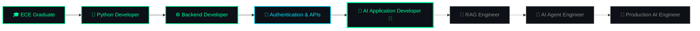

<div align="center">


<br>


</div>

<br>

```text
> Initializing Developer.exe...

  Python                  ██████████  100%
  Git & GitHub             ██████████  100%
  SQL & Databases          ██████████  100%
  FastAPI & REST APIs      ██████████  100%
  Authentication           ██████████  100%
  LLM APIs                 ██████████  100%
  Prompt Engineering       ██████████  100%
  AI Applications          ██████░░░░  60%
  RAG                      ██░░░░░░░░  20%
  AI Agents                ░░░░░░░░░░   0%

> Boot sequence complete.
> Backend foundations secured. AI engineering phase initiated.
```

<br>

## 👋 Hi, I'm Aboobaker

An Electronics & Communication Engineering graduate transitioning into software engineering, with a focus on **Python backend development and AI applications**.

I've been documenting the journey publicly — learning by building, breaking things, debugging them, and shipping projects along the way.

```text
$ whoami
> backend developer transitioning into AI engineering

$ current_status
> Week 5 complete.
> LLM API development unlocked.

$ philosophy
> Build it properly. Understand it fully. Then move on.
```

I take the work seriously.
I keep the README slightly less serious.

Both things can be true.

<br>

---

## 🧠 About Me

```python
class Developer:
    def __init__(self):
        self.name = "Aboobaker Siddique"
        self.background = "Electronics & Communication Engineering"
        self.current_role = "AI Application Developer in Training"

        self.skills = [
            "Python",
            "FastAPI",
            "REST APIs",
            "SQL",
            "SQLAlchemy",
            "Pydantic",
            "Authentication",
            "LLM APIs",
            "Prompt Engineering"
        ]

        self.current_focus = [
            "AI Applications",
            "LLM Engineering",
            "RAG",
            "AI Agents"
        ]

        self.philosophy = (
            "Build it properly, understand it fully, "
            "then move on."
        )

    def next_step(self) -> str:
        return "Build smarter AI systems."


me = Developer()
```

* 🎓 Electronics & Communication Engineering graduate
* 🐍 Python backend development
* ⚙️ FastAPI, REST APIs, SQLAlchemy and databases
* 🔐 Authentication and backend security fundamentals
* 🤖 LLM API integration and prompt engineering
* 🧠 Currently progressing toward RAG, AI Agents and production AI systems
* 🚀 Learning by building real applications instead of only collecting tutorials
* 🎯 Only claim technologies I've actually used and built with

<br>

---

## 🧬 Developer Evolution


```mermaid
graph LR
    A["🎓 ECE Graduate"] --> B["🐍 Python Developer"]
    B --> C["⚙️ Backend Developer"]
    C --> D["🔐 Authentication & APIs"]
    D --> E["🤖 AI Application Developer 📍"]
    E -.-> F["🧠 RAG Engineer"]
    F -.-> G["🧩 AI Agent Engineer"]
    G -.-> H["🚀 Production AI Engineer"]

    style A fill:#0D1117,stroke:#00FF9C,stroke-width:2px,color:#00FF9C
    style B fill:#0D1117,stroke:#00FF9C,stroke-width:2px,color:#00FF9C
    style C fill:#0D1117,stroke:#00FF9C,stroke-width:2px,color:#00FF9C
    style D fill:#0D1117,stroke:#00E5FF,stroke-width:2px,color:#00E5FF
    style E fill:#0D1117,stroke:#00FF9C,stroke-width:3px,color:#00FF9C
    style F fill:#0D1117,stroke:#666666,stroke-width:1px,color:#888888
    style G fill:#0D1117,stroke:#666666,stroke-width:1px,color:#888888
    style H fill:#0D1117,stroke:#666666,stroke-width:1px,color:#888888
```

📍 = current stage · dashed = upcoming stages

<br>

---

## 🛠️ Tech Stack

*Only technologies I've actually used and built projects with.*

### Languages

  

### Backend & APIs

     

### Authentication & Security

   

### AI / LLM

     

### GUI


### Embedded / IoT

 

### Tools

 

<br>

---

## 🤖 AI Engineering Journey

The backend foundation is now complete enough to start building AI applications on top of it.

```text
Python
   ↓
SQL + Databases
   ↓
FastAPI + REST APIs
   ↓
Authentication
   ↓
LLM APIs
   ↓
Prompt Engineering
   ↓
Structured Outputs
   ↓
Tool Calling
   ↓
RAG
   ↓
AI Agents
   ↓
Production AI Systems
```

### Current AI Skills

| Skill                            | Status |
| -------------------------------- | :----: |
| LLM Fundamentals                 |    ✅   |
| LLM APIs                         |    ✅   |
| Prompt Engineering               |    ✅   |
| API Key / Environment Management |    ✅   |
| Structured Outputs               |    ✅   |
| Pydantic + LLM Outputs           |    ✅   |
| Tool / Function Calling          |    ✅   |
| AI Application Development       |   🔄   |
| Embeddings                       |    ⏳   |
| Vector Databases                 |    ⏳   |
| RAG                              |    ⏳   |
| LangChain                        |    ⏳   |
| LangGraph                        |    ⏳   |
| AI Agents                        |    ⏳   |
| MCP                              |    ⏳   |
| Production AI Systems            |    ⏳   |

<br>

---

## 📈 Weekly Learning Progress

| Week    | Status | Focus                                   |
| ------- | :----: | --------------------------------------- |
| Week 1  |    ✅   | Python Fundamentals + Git/GitHub        |
| Week 2  |    ✅   | Intermediate Python + SQL + APIs        |
| Week 3  |    ✅   | FastAPI + REST APIs + SQLAlchemy        |
| Week 4  |    ✅   | Authentication + JWT + Backend Security |
| Week 5  |    ✅   | LLMs + Prompt Engineering + AI APIs     |
| Week 6  |   🔄   | AI Application Development              |
| Week 7  |    ⏳   | LangChain                               |
| Week 8  |    ⏳   | Embeddings + Vector Databases           |
| Week 9  |    ⏳   | RAG                                     |
| Week 10 |    ⏳   | Advanced RAG                            |
| Week 11 |    ⏳   | AI Agents + Tool Workflows              |
| Week 12 |    ⏳   | LangGraph + MCP                         |
| Week 13 |    ⏳   | Production AI                           |
| Week 14 |    ⏳   | Major Portfolio Projects                |
| Week 15 |    ⏳   | Resume + Portfolio + LinkedIn           |
| Week 16 |    ⏳   | Interviews + Job Applications           |

<br>

---

## 🏗️ Current Focus

* 🤖 Building AI-powered applications
* 🧠 Working with LLM APIs
* ✍️ Improving prompt engineering
* 📦 Working with structured LLM outputs
* 🔧 Understanding tool/function calling
* ⚡ Combining FastAPI with AI services
* 📚 Preparing for RAG and vector databases
* 🚀 Building increasingly production-oriented AI projects

<br>

---

## 🏆 Featured Project

### 🤖 Siddique-AI

**Siddique-AI** is my AI application project, built as part of my transition from backend development into AI engineering.

The project represents the completion of my first major AI application milestone and applies the concepts learned during the LLM/API phase of my roadmap.

🔗 **Repository:**
https://github.com/AboobakerSiddique/Siddique-AI

<br>

---

## 💼 Projects

| Project                    | Description                                                                                                            |
| -------------------------- | ---------------------------------------------------------------------------------------------------------------------- |
| **Siddique-AI**            | AI application built as part of my LLM engineering journey, applying LLM APIs and AI application development concepts. |
| **Student Management API** | REST API for managing student records using FastAPI, SQLAlchemy and Pydantic.                                          |
| **Student Management GUI** | Desktop interface for the Student Management system built with Tkinter.                                                |
| **Task Manager API**       | FastAPI backend for creating, updating and tracking tasks with a SQLite database.                                      |
| **Library Management API** | API for managing books, members and borrowing records with REST endpoints and Swagger documentation.                   |
| **Authentication API**     | FastAPI authentication project implementing password hashing, JWT and protected backend functionality.                 |
| **Python Mini Projects**   | Collection of Python utilities and exercises built while strengthening programming fundamentals.                       |
| **AI Developer Roadmap**   | Public repository documenting my structured week-by-week transition into AI engineering.                               |

<br>

---

## 📚 Learning Milestones

### 🐍 Backend Foundation

* ✅ Python fundamentals
* ✅ Git & GitHub
* ✅ Intermediate Python
* ✅ JSON & CSV
* ✅ REST APIs
* ✅ SQL
* ✅ SQLite
* ✅ SQLAlchemy
* ✅ FastAPI
* ✅ Pydantic
* ✅ CRUD
* ✅ Authentication
* ✅ JWT
* ✅ Password hashing
* ✅ API testing

### 🤖 AI Foundation

* ✅ Generative AI fundamentals
* ✅ LLM fundamentals
* ✅ Tokens & context windows
* ✅ Prompt engineering
* ✅ LLM API integration
* ✅ Environment-based API key management
* ✅ Structured outputs
* ✅ Pydantic validation for AI outputs
* ✅ Function / tool calling
* 🔄 AI application development

### 🔜 Next

* ⏳ LangChain
* ⏳ Embeddings
* ⏳ Vector databases
* ⏳ RAG
* ⏳ Advanced RAG
* ⏳ AI Agents
* ⏳ LangGraph
* ⏳ MCP
* ⏳ Production AI

<br>

---

## ⚙️ Previous Engineering Projects

### 🔥 Fire Fighting Robot

Arduino UNO based embedded system using sensors, motors and control logic to detect and respond to fire.

### 🫁 Breath Monitoring System

ESP32-based embedded project using MQ sensors and an OLED display for real-time monitoring.

<br>

---

## 📊 GitHub Stats

<div align="center">


<br><br>


<br><br>


</div>

<br>

---

## 🐍 Contribution Snake

<div align="center">


</div>

<br>

---

## 🎯 2026 Mission

* [x] Build strong Python foundations
* [x] Learn Git & GitHub properly
* [x] Learn SQL and databases
* [x] Learn FastAPI and REST APIs
* [x] Learn authentication and JWT
* [x] Build backend projects
* [x] Learn LLM fundamentals
* [x] Integrate LLM APIs
* [x] Learn prompt engineering
* [x] Build Siddique-AI
* [ ] Learn LangChain
* [ ] Build RAG applications
* [ ] Learn vector databases
* [ ] Build AI agents
* [ ] Learn LangGraph and MCP
* [ ] Build production-grade AI systems
* [ ] Contribute to open source
* [ ] Land my first AI Developer / Backend role

<br>

---

<div align="center">

### 🧠 Human Status

```text
☕ Coffee              100%
🐛 Bugs Fixed          Ongoing
🐍 Python              Loaded
⚙️ Backend              Operational
🤖 AI Knowledge        Loading...
🧠 LLM Skills          Unlocked
💾 Sleep.exe           Not Responding

Veni. Vidi. Vici.
```


</div>
